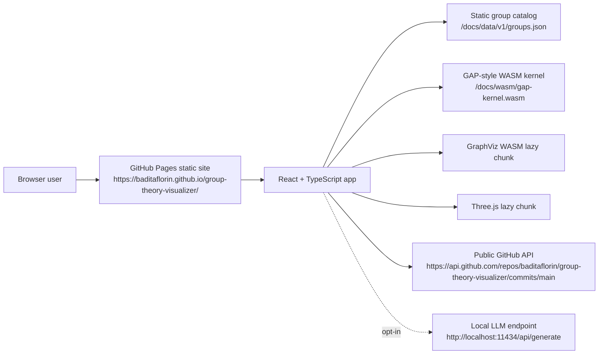

# Group Theory Visualizer


Live site: https://baditaflorin.github.io/group-theory-visualizer/

Repository: https://github.com/baditaflorin/group-theory-visualizer

PayPal: https://www.paypal.com/paypalme/florinbadita

Group Theory Visualizer is a static, browser-first explorer for finite groups, Cayley graphs,
multiplication tables, and symmetry actions. It makes the structure of groups tactile: pick a
finite group, inspect its elements and invariants, render a Cayley map with GraphViz WASM, rotate
the corresponding symmetry scene with Three.js, and optionally ask a local LLM to explain what you
are seeing.

## Demo

Screenshot: https://baditaflorin.github.io/group-theory-visualizer/screenshot.png

Live app: https://baditaflorin.github.io/group-theory-visualizer/

## Quickstart

```sh
npm install
make dev
make test
make build
make smoke
```

## What V1 Includes

- 18 finite groups, including cyclic groups, dihedral groups, V4, Q8, A4, S3, and S4.
- Table-backed GAP-style WASM kernel for products, inverses, and element orders.
- GraphViz WASM Cayley maps, lazy-loaded behind the Map tab.
- Three.js symmetry scenes, lazy-loaded behind the 3D tab.
- Multiplication table, element powers, conjugacy classes, center, exponent, and generated subgroup
  checks.
- Optional local LLM panel using a user-controlled endpoint such as `http://localhost:11434/api/generate`.
- Visible version, embedded build commit, and latest public GitHub commit on the live page.

## Architecture



Architecture notes: docs/architecture.md

ADRs: docs/adr/

Data contract: docs/data.md

Deploy guide: docs/deploy.md

Privacy: docs/privacy.md

## Repository Hygiene

No GitHub Actions are used. Local checks run through `.githooks/`:

```sh
make install-hooks
make hooks-pre-commit
make hooks-pre-push
```

`docs/` is intentionally committed because GitHub Pages serves the production site from
`main` branch `/docs`.
