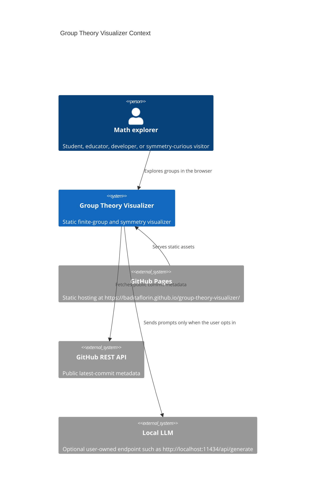

# Architecture

Production URL: https://baditaflorin.github.io/group-theory-visualizer/

Repository URL: https://github.com/baditaflorin/group-theory-visualizer

## Context



## Container View

```mermaid
flowchart TB
  subgraph pages["GitHub Pages boundary"]
    html["docs/index.html"]
    assets["Hashed JS/CSS assets"]
    data["docs/data/v1/groups.json"]
    kernel["docs/wasm/gap-kernel.wasm"]
    sw["docs/sw.js"]
  end

  subgraph browser["Browser runtime"]
    shell["React app shell"]
    math["Finite group logic"]
    wasm["WASM table kernel"]
    graph["GraphViz WASM map view"]
    scene["Three.js symmetry view"]
    storage["localStorage preferences"]
    assistant["Optional local LLM panel"]
  end

  html --> shell
  assets --> shell
  data --> math
  kernel --> wasm
  shell --> math
  shell --> graph
  shell --> scene
  shell --> storage
  shell --> assistant
```

## Module Boundaries

- `src/features/groups/` owns group data validation, operations, invariants, Cayley edge generation,
  and the WASM kernel adapter.
- `src/features/visualization/` owns GraphViz and Three.js rendering.
- `src/features/assistant/` owns local LLM UX and fetch behavior.
- `src/lib/` owns version metadata, GitHub metadata, and local storage helpers.
- `scripts/` owns deterministic catalog generation, WASM compilation, Pages cleanup, and smoke
  orchestration.

## Pages Boundary

GitHub Pages serves only committed static files from `main` branch `/docs`. The app has no runtime
backend, no server-side logs, no secrets, no auth, and no runtime database.
